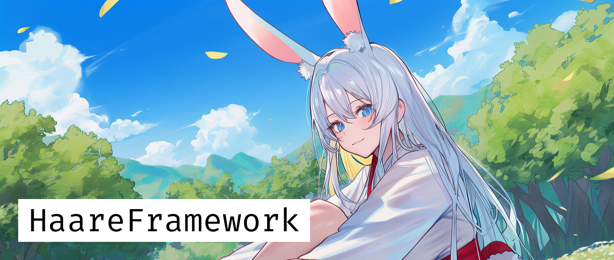

# Korean



* 해당 프로젝트에서 사용된 이미지는 AI가 사용되었습니다.

# HaareFramework
**Unity UI 기반 게임을 위한 한 마리 토끼**

> Hare가 아니라 Haare!

HaareFramework는 `VContainer`, `UniTask`, `R3`를 기반으로 생애주기와 코드의 흐름을 중앙에서 관리하고, DI를 통한 모듈화 구성을 목표로 만들어진 경량 프레임워크입니다.

*이 프레임워크는 기반이 되는 프레임워크가 존재합니다!*
* [SubmarineMirageFramework](https://github.com/FromSeabedOfReverie/SubmarineMirageFrameworkForUnity)

Processer, Routine 등의 Core 설계에 있어 많은 부분이 해당 프레임워크에서 영감을 받아, 모바일/UI 중심 게임에 맞게 재설계되었습니다. 멋진 구조와 코드를 설계해주신 원작자분들께 감사드립니다!

## Architecture

* **Routine 기반 중앙화된 생애주기 (`Processer` & `Routine`)**
    * `MonoBehaviour`의 파편화된 생애주기를 `Processer`가 중앙에서 통합 관리합니다.
    * **MonoRoutine**: GameObject에 부착되는 컴포넌트입니다.
    * **NativeRoutine**: 순수 C# 클래스임에도 `Update`, `Initialize`, `Finalize` 등 Unity 생애주기를 가질 수 있어, 로직과 뷰를 철저히 분리할 수 있습니다.

* **DI & MVP (`VContainer`)**
    * **LifetimeScope**: `CoreLifetimeScope`가 전역 서비스를, 씬별 Scope가 로컬 서비스를 관리합니다.
    * **Presenter**: `IPresenter`를 통해 `UIManager`, `SceneService` 등을 주입받아 View와 Model을 중재합니다.

* **Reactive 프로그래밍 (`R3`)**
    * `CustomButton` 등 UI 컴포넌트의 입력 이벤트와 데이터의 변화는 `R3`의 스트림(`Observable`, `ReactiveProperty`)으로 처리되어, 콜백 지옥 없는 반응형 로직을 구현합니다.

* **Data & Asset Management**
    * **AssetLoader**: Addressables를 `UniTask` 기반으로 래핑하여 비동기 리소스 로딩을 간편하게 처리합니다.
    * **DataManager**: JSON 데이터와 ScriptableObject를 매핑하여 로컬/원격 데이터를 일관된 인터페이스로 제공합니다.

## Usage Example (실용 예시)

HaareFramework를 사용하여 순수 C# 클래스(`NativeRoutine`)가 Unity의 Update 루프를 돌며 서비스를 사용하는 예시입니다.

### 1. 서비스 및 루틴 정의

```csharp
using Haare.Core;
using Haare.DI;
using Cysharp.Threading.Tasks;
using UnityEngine;
using VContainer;

// 1. 간단한 서비스 인터페이스와 구현체 정의
public interface IGameScoreService
{
    void AddScore(int amount);
    int GetScore();
}

public class GameScoreService : IGameScoreService
{
    private int _currentScore = 0;
    public void AddScore(int amount) => _currentScore += amount;
    public int GetScore() => _currentScore;
}

// 2. NativeRoutine을 상속받은 게임 로직 클래스 정의
// MonoBehaviour가 아니지만 Update와 비동기 Initialize를 가집니다.
public class MyGameLogicRoutine : NativeRoutine
{
    private readonly IGameScoreService _scoreService;
    private float _timer;

    // VContainer가 생성자 주입을 통해 서비스를 주입합니다.
    [Inject]
    public MyGameLogicRoutine(IGameScoreService scoreService)
    {
        _scoreService = scoreService;
    }

    // 비동기 초기화 (Processer에 의해 호출됨)
    public override async UniTask Initialize(System.Threading.CancellationToken cts)
    {
        await base.Initialize(cts);
        Debug.Log("Game Logic Initialized!");
        _timer = 0f;
    }

    // 매 프레임 호출되는 업데이트 (Processer에 의해 관리됨)
    protected override void UpdateProcess()
    {
        _timer += Time.deltaTime;
        if (_timer >= 1.0f)
        {
            _scoreService.AddScore(10);
            Debug.Log($"Current Score: {_scoreService.GetScore()}");
            _timer = 0f;
        }
    }
}
```

### 2. 의존성 등록 (LifetimeScope)
씬의 LifetimeScope에서 위에서 만든 클래스들을 등록합니다.

``` C#
using Haare.DI;
using VContainer;
using VContainer.Unity;

public class GameSceneScope : LifetimeScope
{
    protected override void Configure(IContainerBuilder builder)
    {
        // 서비스 등록 (싱글톤)
        builder.Register<IGameScoreService, GameScoreService>(Lifetime.Singleton);

        // NativeRoutine 등록 (Entry Point로 지정하여 Processer가 관리 시작)
        builder.RegisterEntryPoint<MyGameLogicRoutine>();
    }
}
```
## Features
* #### Scene Service: 씬 전환 시 로딩 화면 처리 및 씬 간 데이터 전달 (Argument) 지원

* #### Stack 기반 UI 시스템: SceneUIManager를 통해 패널을 스택으로 관리하며, [PanelAttribute]를 사용해 Addressable 경로와 자동 연동

* #### 통합 유틸리티: DOTween이 내장된 UI 컴포넌트(CustomImage, CustomButton) 및 LogHelper 제공

## Setup
사전 요구 사항
> Unity 2022.3 LTS 이상 (권장)

> Addressables 패키지 설치

> TextMeshPro 패키지 설치

### 의존성 설치 (Dependencies)
본 프레임워크는 다음 라이브러리에 의존성을 가집니다. UPM(Git URL)을 통해 설치해 주세요.

#### VContainer

> https://github.com/hadashiA/VContainer.git?path=VContainer/Assets/VContainer

#### R3

> https://github.com/Cysharp/R3.git?path=src/R3.Unity/Assets/R3.Unity

#### UniTask

> https://github.com/Cysharp/UniTask.git?path=src/UniTask/Assets/Plugins/UniTask

DOTween (무료 버전 가능)
> Asset Store에서 임포트 혹은 Pro 버전 사용

## DEMO
Assets/Haare/Demo/Scene/TitleScene.unity

씬을 실행하시면 프레임워크의 기본 흐름을 확인하실 수 있습니다.

## 📜 라이선스 (License)
이 프로젝트는 MIT 라이선스를 따릅니다. 자세한 내용은 LICENSE 파일을 확인해 주세요.

---


# Japanese


* 本プロジェクトで使用されている画像はAIによって生成されました。

# HaareFramework
**Unity UIベースのゲームのための「一匹のウサギ」**

> Hare(野ウサギ)ではなく、Haare!

HaareFrameworkは、`VContainer`、`UniTask`、`R3`をベースに、ライフサイクルとコードフローを中央で管理し、DIを通じたモジュール化構成を目指して作られた軽量フレームワークです。

*このフレームワークにはベースとなる素晴らしいフレームワークが存在します！*
* [SubmarineMirageFramework](https://github.com/FromSeabedOfReverie/SubmarineMirageFrameworkForUnity)

ProcesserやRoutineなどのCore設計において、多くの部分でこのフレームワークからインスピレーションを得て、モバイル/UI中心のゲームに合わせて再設計されました。素晴らしい構造とコードを設計してくださった原作者の方々に感謝いたします！

## Architecture

* **Routineベースの集中型ライフサイクル (`Processer` & `Routine`)**
    * `MonoBehaviour`の断片化されたライフサイクルを`Processer`が中央で統合管理します。
    * **MonoRoutine**: GameObjectにアタッチされるコンポーネントです。
    * **NativeRoutine**: 純粋なC#クラスでありながら、`Update`、`Initialize`、`Finalize`などのUnityライフサイクルを持つことができ、ロジックとビューを徹底的に分離できます。

* **DI & MVP (`VContainer`)**
    * **LifetimeScope**: `CoreLifetimeScope`がグローバルサービスを、各シーンのScopeがローカルサービスを管理します。
    * **Presenter**: `IPresenter`を通じて`UIManager`や`SceneService`などを注入(Inject)され、ViewとModelを仲介します。

* **Reactiveプログラミング (`R3`)**
    * `CustomButton`などのUIコンポーネントの入力イベントやデータの変化は、`R3`のストリーム(`Observable`、`ReactiveProperty`)として処理され、コールバック地獄のないリアクティブなロジックを実現します。

* **Data & Asset Management**
    * **AssetLoader**: Addressablesを`UniTask`ベースでラップし、非同期リソースロードを簡潔に処理します。
    * **DataManager**: JSONデータとScriptableObjectをマッピングし、ローカル/リモートデータを一貫したインターフェースで提供します。

## Usage Example (実用例)

HaareFrameworkを使用して、純粋なC#クラス（`NativeRoutine`）がUnityのUpdateループを回しながらサービスを使用する例です。

### 1. サービスおよびルーチンの定義

```csharp
using Haare.Core;
using Haare.DI;
using Cysharp.Threading.Tasks;
using UnityEngine;
using VContainer;

// 1. 簡単なサービスインターフェースと実装を定義
public interface IGameScoreService
{
    void AddScore(int amount);
    int GetScore();
}

public class GameScoreService : IGameScoreService
{
    private int _currentScore = 0;
    public void AddScore(int amount) => _currentScore += amount;
    public int GetScore() => _currentScore;
}

// 2. NativeRoutineを継承したゲームロジッククラスを定義
// MonoBehaviourではありませんが、Updateと非同期Initializeを持ちます。
public class MyGameLogicRoutine : NativeRoutine
{
    private readonly IGameScoreService _scoreService;
    private float _timer;

    // VContainerがコンストラクタ注入を通じてサービスを注入します。
    [Inject]
    public MyGameLogicRoutine(IGameScoreService scoreService)
    {
        _scoreService = scoreService;
    }

    // 非同期初期化 (Processerによって呼び出されます)
    public override async UniTask Initialize(System.Threading.CancellationToken cts)
    {
        await base.Initialize(cts);
        Debug.Log("Game Logic Initialized!");
        _timer = 0f;
    }

    // 毎フレーム呼び出されるアップデート (Processerによって管理されます)
    protected override void UpdateProcess()
    {
        _timer += Time.deltaTime;
        if (_timer >= 1.0f)
        {
            _scoreService.AddScore(10);
            Debug.Log($"Current Score: {_scoreService.GetScore()}");
            _timer = 0f;
        }
    }
}
```

### 2. 依存関係の登録 (LifetimeScope)
シーンのLifetimeScopeで、上記で作成したクラスを登録します。

```csharp
using Haare.DI;
using VContainer;
using VContainer.Unity;

public class GameSceneScope : LifetimeScope
{
    protected override void Configure(IContainerBuilder builder)
    {
        // サービスを登録 (シングルトン)
        builder.Register<IGameScoreService, GameScoreService>(Lifetime.Singleton);

        // NativeRoutineを登録 (EntryPointとして指定し、Processerが管理を開始)
        builder.RegisterEntryPoint<MyGameLogicRoutine>();
    }
}
```

## Features
* #### Scene Service: シーン遷移時のロード画面処理およびシーン間のデータ受け渡し(Argument)をサポート

* #### StackベースのUIシステム: SceneUIManagerを通じてパネルをスタック管理し、[PanelAttribute]を使用してAddressableパスと自動連携

* #### 統合ユーティリティ: DOTweenが組み込まれたUIコンポーネント(CustomImage, CustomButton)およびLogHelperを提供

## Setup
事前要件 (Prerequisites)
> Unity 2022.3 LTS 以上 (推奨)

> Addressables パッケージのインストール

> TextMeshPro パッケージのインストール

### 依存関係のインストール (Dependencies)
本フレームワークは以下のライブラリに依存しています。UPM(Git URL)経由でインストールしてください。

#### VContainer

> [https://github.com/hadashiA/VContainer.git?path=VContainer/Assets/VContainer](https://github.com/hadashiA/VContainer.git?path=VContainer/Assets/VContainer)

#### R3

> [https://github.com/Cysharp/R3.git?path=src/R3.Unity/Assets/R3.Unity](https://github.com/Cysharp/R3.git?path=src/R3.Unity/Assets/R3.Unity)

#### UniTask

> [https://github.com/Cysharp/UniTask.git?path=src/UniTask/Assets/Plugins/UniTask](https://github.com/Cysharp/UniTask.git?path=src/UniTask/Assets/Plugins/UniTask)

DOTween (無料版も可)
> Asset Storeからインポート、またはPro版を使用

## DEMO
Assets/Haare/Demo/Scene/TitleScene.unity

シーンを実行すると、フレームワークの基本的な流れを確認できます。

## 📜 ライセンス (License)
このプロジェクトはMITライセンスの下で公開されています。詳細はLICENSEファイルをご確認ください。